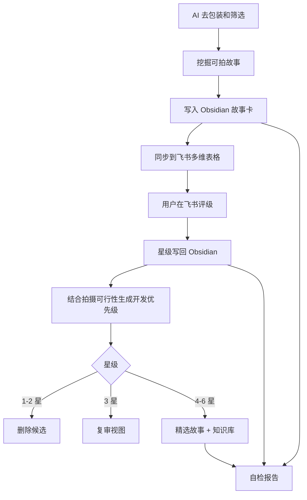

# 流程总览

## 一句话说明

这是一套把“素材收集”变成“素材筛选和沉淀”的工作流。

AI 助手负责重活，但不是搬运新闻：它先去掉宣传包装和眼球标题，筛掉噱头，再挖掘真正值得电影化、微电影化的故事。Obsidian 负责长期保存，飞书多维表格负责快速评级，飞书知识库负责保留精品。

## 四个角色

| 工具 | 职责 | 不负责 |
|---|---|---|
| AI 助手 | 挖掘、去包装、核验、筛选、改写、补全字段、自检 | 最终评级 |
| Obsidian | 长期资料库、完整故事卡、精选入口 | 快速批量打星 |
| 飞书多维表格 | 快速看标题、简介和拍摄可行性，打星评级 | 保存完整资料 |
| 飞书知识库 | 沉淀 4-6 星精品故事，并保留开发判断 | 收纳所有素材 |

## 日常流程



## 故事挖掘七步

| 顺序 | 动作 | 要做什么 |
|---:|---|---|
| 1 | 去包装 | 去掉标题党、宣传话术、营销口号、情绪化形容词，只保留可核实事实。 |
| 2 | 拆事实 | 区分已发生事实、当事人说法、机构说法、媒体判断和待核验信息。 |
| 3 | 查夸张 | 宣传报道、通稿、表彰稿、热点新闻默认降权，除非能找到具体过程、矛盾、失败和代价。 |
| 4 | 挖故事 | 追问前因后果、人物处境、关系变化、长期动作、场景道具和后续结果。 |
| 5 | 测可拍 | 问拍 10 分钟、30 分钟、90 分钟分别能拍什么推进。 |
| 6 | 定去留 | 通过则建故事卡；有线索但不完整进收件箱；只有噱头则跳过。 |
| 7 | 记原因 | 在总览或运行记录里写清入库理由、待补事实或跳过原因。 |

一句话新闻钩子不是可拍性。比如“因为蓝牙名飞机返航”，如果展开后只有等待、广播、返航、检查和新闻解释，没有人物推进、关系变化和情感代价，就不应该进入正式故事卡。

## 四道入库门

正式故事入库前，先过四道门：

| 门槛 | 判断问题 |
|---|---|
| 人物门 | 是否有一个可跟随的人、群体、地方或物件，而不是只有机构、政策或公共议题？ |
| 关系门 | 这个选择或事件是否改变了亲子、夫妻、同伴、师徒、雇佣、病患、邻里等具体关系？ |
| 时间门 | 是否有之前、转折和之后，而不是只有一晚、一条禁令、一次事故或一个现场？ |
| 影像门 | 是否有能承载命运的空间、道具、动作、声音或身体状态？ |

如果四道门里缺了两道以上，优先放进收件箱、场景灵感或直接跳过，不急着建正式故事卡。

## 当前收集偏好

当前流程优先服务微电影和短片开发。默认比例是：

| 体量 | 比例 | 说明 |
|---|---:|---|
| 微电影/短片优先 | 约 70% | 聚焦几个人、一段回忆、一件物、一个空间或一个长期动作。 |
| 中等体量 | 约 20% | 时间跨度或人物关系更复杂，但仍落到一个家庭、一家店、一所学校、一个病房、一辆车、一封信或一件物。 |
| 大场景/宏大历史 | 0-5% | 只保留极少数能完全落到个人、地方生活、手艺或职业关系的小切口。 |

地区配额不能压过质量门槛。如果当天新闻不够强，可以找已核验的历史档案、人物报道、口述史、纪实文本或长报道。

## 当前禁收题材

后续不主动收集以下题材：

- 战争、战役、战场行动、军队、特工、间谍、情报网络、占领区、抵抗组织、军事技术、空战、核战争危机和战争英雄叙事。
- 种族、族裔、跨种族制度冲突、种族隔离、民权斗争和身份群体对抗类素材。

不要用“小道具”“小人物”包装大题材。如果故事底层看点仍是战争机器、军事行动或种族制度冲突，就不进入正式故事卡。

## 为什么这样分工

飞书多维表格适合“快判断”，但不适合长期阅读完整资料。

Obsidian 适合“长期积累”，但不适合在手机或多人场景里快速评级。

知识库适合“看精品”，但不应该堆满所有待筛选材料。

所以这个流程把飞书表格压缩到最轻，只保留评级所需信息，把完整资料留在 Obsidian，把好故事再沉淀到知识库。

星级只评故事价值，不评拍摄难度。拍摄难度写入 `拍摄可行性`，开发去向写入 `开发优先级`，可执行小入口写入 `低成本切口`。这些字段要出现在 Obsidian 工作台、精选 Base、周/月优化、删除候选、飞书辅助视图和飞书知识库里，不能只藏在故事卡字段中。

## 核心字段

最重要的同步主键是：

```text
文件路径
```

不要用标题、来源链接或飞书记录 ID 代替它。标题会改，链接会失效，记录 ID 会迁移，但故事卡路径能稳定指向 Obsidian 里的那张卡。
