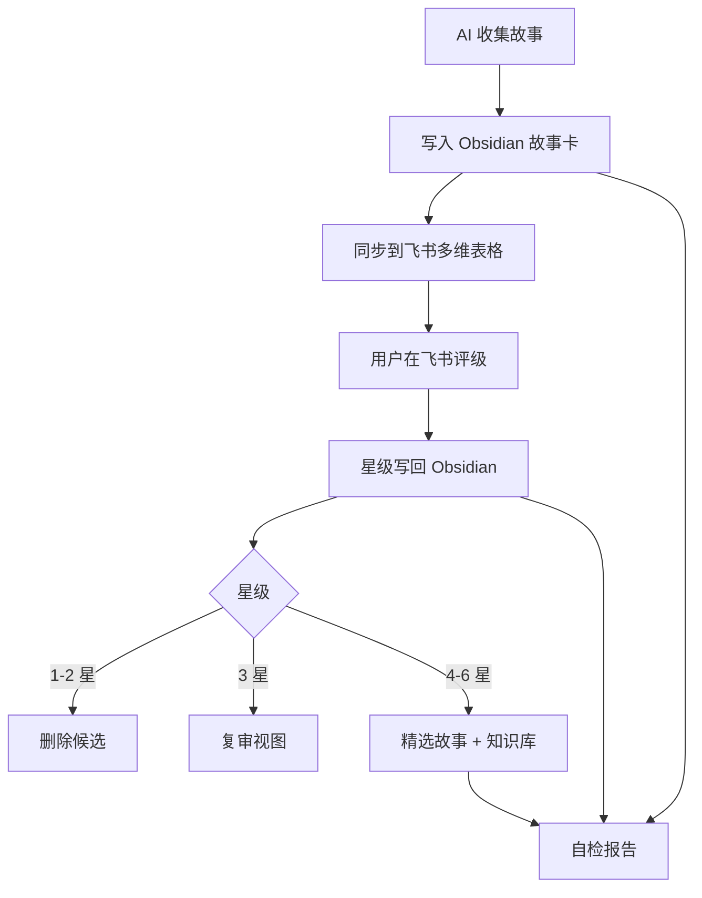

# 流程总览

## 一句话说明

这是一套把“素材收集”变成“素材筛选和沉淀”的工作流。

AI 助手负责重活，Obsidian 负责长期保存，飞书多维表格负责快速评级，飞书知识库负责保留精品。

## 四个角色

| 工具 | 职责 | 不负责 |
|---|---|---|
| AI 助手 | 收集、核验、改写、补全字段、自检 | 最终评级 |
| Obsidian | 长期资料库、完整故事卡、精选入口 | 快速批量打星 |
| 飞书多维表格 | 快速看标题和简介，打星评级 | 保存完整资料 |
| 飞书知识库 | 沉淀 4-6 星精品故事 | 收纳所有素材 |

## 日常流程



## 为什么这样分工

飞书多维表格适合“快判断”，但不适合长期阅读完整资料。

Obsidian 适合“长期积累”，但不适合在手机或多人场景里快速评级。

知识库适合“看精品”，但不应该堆满所有待筛选材料。

所以这个流程把飞书表格压缩到最轻，只保留评级所需信息，把完整资料留在 Obsidian，把好故事再沉淀到知识库。

## 核心字段

最重要的同步主键是：

```text
文件路径
```

不要用标题、来源链接或飞书记录 ID 代替它。标题会改，链接会失效，记录 ID 会迁移，但故事卡路径能稳定指向 Obsidian 里的那张卡。

