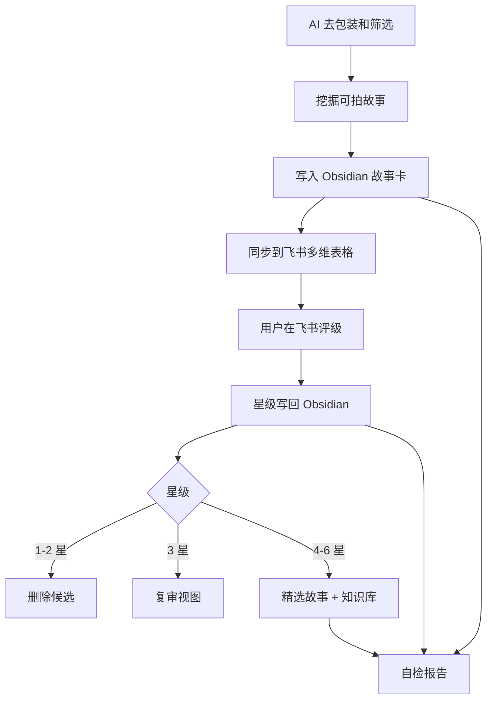

# 流程总览

## 一句话说明

这是一套把“素材收集”变成“素材筛选和沉淀”的工作流。

AI 助手负责重活，但不是搬运新闻：它先去掉宣传包装和眼球标题，筛掉噱头，再挖掘真正值得电影化、微电影化的故事。Obsidian 负责长期保存，飞书多维表格负责快速评级，飞书知识库负责保留精品。

## 四个角色

| 工具 | 职责 | 不负责 |
|---|---|---|
| AI 助手 | 挖掘、去包装、核验、筛选、改写、补全字段、自检 | 最终评级 |
| Obsidian | 长期资料库、完整故事卡、精选入口 | 快速批量打星 |
| 飞书多维表格 | 快速看标题和简介，打星评级 | 保存完整资料 |
| 飞书知识库 | 沉淀 4-6 星精品故事 | 收纳所有素材 |

## 日常流程



## 故事挖掘七步

| 顺序 | 动作 | 要做什么 |
|---:|---|---|
| 1 | 去包装 | 去掉标题党、宣传话术、营销口号、情绪化形容词，只保留可核实事实。 |
| 2 | 拆事实 | 区分已发生事实、当事人说法、机构说法、媒体判断和待核验信息。 |
| 3 | 查夸张 | 宣传报道、通稿、表彰稿、热点新闻默认降权，除非能找到具体过程、矛盾、失败和代价。 |
| 4 | 挖故事 | 追问前因后果、人物处境、关系变化、长期动作、场景道具和后续结果。 |
| 5 | 测可拍 | 问拍 10 分钟、30 分钟、90 分钟分别能拍什么推进。 |
| 6 | 定去留 | 通过则建故事卡；有线索但不完整进收件箱；只有噱头则跳过。 |
| 7 | 记原因 | 在总览或运行记录里写清入库理由、待补事实或跳过原因。 |

一句话新闻钩子不是可拍性。比如“因为蓝牙名飞机返航”，如果展开后只有等待、广播、返航、检查和新闻解释，没有人物推进、关系变化和情感代价，就不应该进入正式故事卡。

## 为什么这样分工

飞书多维表格适合“快判断”，但不适合长期阅读完整资料。

Obsidian 适合“长期积累”，但不适合在手机或多人场景里快速评级。

知识库适合“看精品”，但不应该堆满所有待筛选材料。

所以这个流程把飞书表格压缩到最轻，只保留评级所需信息，把完整资料留在 Obsidian，把好故事再沉淀到知识库。

## 核心字段

最重要的同步主键是：

```text
文件路径
```

不要用标题、来源链接或飞书记录 ID 代替它。标题会改，链接会失效，记录 ID 会迁移，但故事卡路径能稳定指向 Obsidian 里的那张卡。
